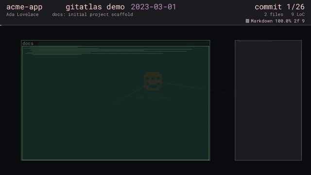

# gitatlas

[](https://github.com/SupremeVoid/gitatlas/actions/workflows/ci.yml)
[](LICENSE)

**Render the evolution of a git repository as an animated treemap "atlas" video.**

`gitatlas` is a git timeline visualizer: it draws the repository as a dense, tiled
**atlas page** — a stable treemap where every folder is a bordered region and
every file is a tile filled with "minimap" lines (proportional to the file's
size in lines of code). As it replays history commit-by-commit, tiles grow,
shrink and fade with smooth transitions, committer avatars hover over the map,
and glowing beams connect each author to the files they touched.

The single output is a video file, encoded with your system `ffmpeg`.

## Example



*A 26-commit demo project rendered in ~7 seconds: folders grow as files are
added, each committer gets a uniquely-colored avatar that beams to the files they
touch, and the top bar tracks the date, author, file/LoC totals and language mix.
Generate your own with `gitatlas /path/to/repo -o atlas.mp4`.*

---

## Features

- **Stable treemap layout** — an ordered "squarified" pack over name-sorted
  siblings with recursive containment, so persisting files stay put and the
  video is watchable, not a flickering mess. Level-of-detail collapses folders
  that are too small to resolve and re-opens them as they grow.
- **Minimap lines** — each file tile is filled with faux code lines; the count
  scales with the file's line count and is capped so one huge/generated file
  can't dominate.
- **Smooth transitions** — added tiles grow in, deleted tiles shrink and fade,
  modified tiles glow; geometry morphs by interpolating between commit states.
- **Committer avatars + beams** — one avatar per active author, each with its own
  **unique color** that its beams inherit. Beams last exactly as long as their
  commit is on screen (`--beam-seconds` sets a floor for fast-forwarded repos). Avatars **wander** over the weighted
  centroid of their recent changes, their **name flows beneath them**, and they
  **fade out after 5 s** of video time with no new commit. Avatar image is
  resolved from an **avatar-config file** (`name/email = image`), then an image
  **directory**, then **gravatar** (opt-in), falling back to one of **14 built-in
  pixel icons** chosen per committer and tinted with their color.
- **Language split** — the HUD shows the live breakdown of the tree by
  programming language (by lines), with colored swatches.
- **Submodules** — git submodules are included by default as small tiles that
  flash when their pointer is bumped; toggle with `--no-submodules` or filter by
  name with `--include-submodule` / `--exclude-submodule`.
- **Per-module border colors** — every top-level folder gets a stable hue (from a
  hash of its name), shared by its whole subtree, matching the reference atlas
  look. If most of the repo sits under one chain such as `src/app/`, gitatlas
  **auto-descends** to the level where the tree actually splits and colors *those*
  folders instead (the chain itself turns neutral gray). Steer it by hand with
  `--color-root FOLDER` (color by that folder's subfolders) and
  `--color-module FOLDER` (that folder is one color of its own), or switch it off
  with `--no-auto-color`.
- **Dedicated meta bar** — commit date, author, subject, counter and file/LoC
  stats live in a reserved bar at the top of the frame (never overlapping the
  atlas); the whole bar is removable with `--no-hud`, and individual parts with
  `--no-date` / `--no-author` / `--no-progress`.
- **Binary & ignored files excluded** — binary files (detected by git) never
  appear; only tracked, non-binary files are drawn.
- **Path filters** — `--include GLOB` / `--exclude GLOB` (repeatable) restrict the
  visualization to matching files/folders, e.g. `--include "src/**"` or
  `--exclude "vendor/**"` to drop vendored dependencies.
- **Depth control** — `--max-depth N` caps folder nesting; `--depth-mode` chooses
  what happens to deeper items: `omit` (default) drops them for a clean shallow
  map, or `collapse` merges each too-deep subfolder into a single aggregate tile.
- **Folder balancing** — in a monorepo one huge module would normally take most
  of the map. `--balance` (default 0.25) compresses how area is split among
  sibling folders, so big modules stay biggest but small ones remain readable —
  no need to exclude anything. `--balance 0` is strictly proportional.
- **Time windows start from the real repo** — with `--since` / `--max-commits`
  the video opens on the repository as it already was before the first commit
  in the window, then animates only what changes (`--empty-start` to grow it
  from nothing instead).
- **Adapts to repo size** — maps commits onto the target video length. Long
  videos / small repos animate each commit ("smooth"); huge repos fast-forward
  gracefully with recent-activity highlights.
- **Fast** — pure-Rust, multi-threaded CPU rendering piped straight to ffmpeg.
  ~20k-commit repos render in seconds; history is cached on disk so re-renders
  with different visual options skip the git pass.
- **Highly configurable** — folder depth, labels, minimap density, avatars,
  beams, HUD, colors, resolution, codec, quality and timing are all toggleable.

## Requirements

- **git** (used to read history) — any recent version.
- **ffmpeg** (used to encode the video) — must include `libx264` (for MP4) and/or
  `libvpx-vp9` (for WebM). On Debian/Ubuntu: `sudo apt install git ffmpeg`.
- **Rust** toolchain to build — a recent stable (2024 edition). No C toolchain
  or cmake needed; every dependency is pure Rust.

## Install

```bash
git clone https://github.com/SupremeVoid/gitatlas.git && cd gitatlas
cargo build --release
# binary at target/release/gitatlas  (copy it onto your PATH)
sudo install -m755 target/release/gitatlas /usr/local/bin/
```

Or download a prebuilt Linux binary from the repository's **Releases** page
(built by the release workflow on every version tag), or — once published to
crates.io:

```bash
cargo install gitatlas
```

## Quick start

```bash
# Visualize the repo in the current directory as a 60s 1440p MP4.
gitatlas . -o atlas.mp4

# A 30-second 1080p tour of a big repo, fast draft quality.
gitatlas /path/to/repo -o out.mp4 --resolution 1920x1080 --seconds 30 --quality draft

# Slow, per-commit animation of the last 300 commits (smooth mode).
gitatlas /path/to/repo --max-commits 300 --seconds-per-commit 0.4 -o recent.mp4

# WebM/VP9 output, no avatars, deeper folder labels.
gitatlas . -o atlas.webm --codec webm --no-avatars --dir-name-max-depth 3   # label only the top 3 levels
```

## How it works

```
 git log --raw --numstat   →  ingest   →  evolving model  →  treemap layout
   (one streaming pass)         │             (path→lines)      (stable, per-frame)
                                ▼
                         per-frame plan  →  parallel CPU raster  →  ffmpeg (rgb24 stdin)
                     (interp + avatars +      (tiny-skia + fontdue)      → mp4 / webm
                      beams + highlights)
```

1. **Ingest** — one `git log --reverse --first-parent --raw --numstat` pass
   yields, per commit, the author, timestamp and the Added/Modified/Deleted
   status + line-count delta of every changed file. Binary files (shown as `-`
   by `--numstat`) are dropped. Line counts are the natural metric for a
   "minimap lines" visualization, and no blob contents are ever read.
2. **Model** — an evolving `path → line-count` map is advanced commit by commit
   and turned into a folder tree.
3. **Layout** — a stable, order-preserving treemap is computed as a pure
   function of the current tree (see `src/layout.rs`).
4. **Timeline** — output frames are mapped onto commit positions; each frame
   interpolates between the two bracketing states and gathers the active
   avatars/beams/highlights.
5. **Render** — frames are rasterized in parallel (one reusable pixmap per
   worker) and piped as raw `rgb24` to a single ffmpeg process.

See [`CLAUDE.md`](CLAUDE.md) for the full architecture.

## Commands

```
gitatlas [OPTIONS] [REPO]           # render (default); REPO defaults to "."
gitatlas render [OPTIONS] [REPO]
gitatlas info [REPO]                # commits, authors, files, date range
gitatlas languages [REPO]           # language breakdown of the final tree
gitatlas gen-config [REPO] -o gitatlas.toml   # write a reusable, commented config
gitatlas --config gitatlas.toml [REPO]        # render using a saved config
gitatlas snapshot [REPO] --at <rev> -o still.png   # still PNG of one commit
gitatlas help [COMMAND]             # detailed, grouped help
```

### Still images

`gitatlas snapshot` renders a single commit's state straight to a **PNG** (no
ffmpeg, no floating avatars) with that commit's changed files highlighted. Pick
the commit by revision, index, or date:

```bash
gitatlas snapshot /repo -o still.png                 # HEAD
gitatlas snapshot /repo --at v1.2.0 -o v1.2.png      # any git revision
gitatlas snapshot /repo --commit 8000 -o c8000.png   # Nth commit in history
gitatlas snapshot /repo --date 2021-01-01 -o y2021.png
```

### Reusable config files

`gitatlas gen-config <repo>` writes a **fully-commented** `gitatlas.toml`: every
option at its default (each line documented inline), plus one `[[committer]]`
block per committer in the repo with an editable display `label` and an `image`
path. Fill those in once, then reuse it:

```bash
gitatlas gen-config /repo -o gitatlas.toml     # generate
$EDITOR gitatlas.toml                          # set labels + image paths
gitatlas /repo --config gitatlas.toml -o out.mp4   # render (CLI flags still override)
```

## Options

Run `gitatlas --help` for the complete, grouped list. Highlights:

| Area | Flags |
|------|-------|
| Git & input | `--rev`, `--since`, `--until`, `--max-commits`, `--empty-start`, `--full-history`, `--no-submodules`, `--include-submodule NAME`, `--exclude-submodule NAME` |
| Files & folders | `--include GLOB`, `--exclude GLOB` (repeatable; matched against the repo-relative path, exclude wins) |
| Output/timing | `-o/--out`, `--codec mp4\|webm`, `--quality draft\|balanced\|high`, `--resolution WxH`, `--fps`, `--seconds`, `--seconds-per-commit`, `--threads` |
| Layout | `--max-depth`, `--depth-mode omit\|collapse`, `--balance`, `--gamma`, `--size-cap`, `--min-open-px`, `--pad`, `--margin`, `--saturation`, `--background #RRGGBB` |
| Color groups | `--color-root FOLDER`, `--color-module FOLDER` (both repeatable), `--no-auto-color` |
| Tiles | `--no-minimap`, `--minimap-line-gap`, `--minimap-max-lines`, `--no-border`, `--border-width` |
| Labels | `--no-dir-names`, `--dir-name-max-depth`, `--file-names`, `--file-name-min-px`, `--label-size` |
| Avatars/beams | `--no-avatars`, `--no-avatar-names`, `--avatar-size`, `--avatar-config FILE`, `--avatar-dir DIR`, `--gravatar`, `--no-beams`, `--beam-intensity`, `--beam-seconds` |
| Animation | `--transition`, `--highlight-seconds`, `--avatar-idle-seconds` |
| HUD | `--no-hud`, `--no-date`, `--no-author`, `--no-progress`, `--no-langs`, `--title` |
| Misc | `--config FILE`, `--no-cache`, `--dry-run` |

**Avatar config file** (`--avatar-config`) — a lightweight alternative to the full
config: one `key = image` per line, where `key` is a committer name or email
(case-insensitive); image paths are relative to the file:

```ini
# avatars.conf
Ada Lovelace   = ada.png
torvalds@…     = linus.jpg
```

## Performance

Rendering is multi-threaded across all cores; frames are reordered and streamed
in-order to ffmpeg. Parsed history is cached under `<repo>/.git/gitatlas-history.bin`,
so only the first run pays the `git log` cost. Use `--quality draft` while
iterating, and `--dry-run` to preview the plan (frame count, mode) without
rendering.

## Development

```bash
cargo build --release      # optimized binary
cargo test                 # unit tests (model, layout, date/number/color parsing)
cargo clippy --all-targets # lints
cargo fmt --all            # formatting
```

CI (`.github/workflows/ci.yml`) runs fmt, clippy (`-D warnings`), the tests, a
release build and a no-ffmpeg smoke test on every pull request. Pushing a version
tag (`git tag v1.0.0 && git push --tags`) triggers the release workflow, which
builds the Linux binary and attaches a `.tar.gz` to a GitHub release. Architecture
notes live in [`CLAUDE.md`](CLAUDE.md).

## License

MIT — see [`LICENSE`](LICENSE). Bundled font and other third-party notices are in
[`NOTICE.md`](NOTICE.md); the full license text of every Rust dependency is in
[`THIRD-PARTY-LICENSES.md`](THIRD-PARTY-LICENSES.md) (also shipped in each release
archive).
